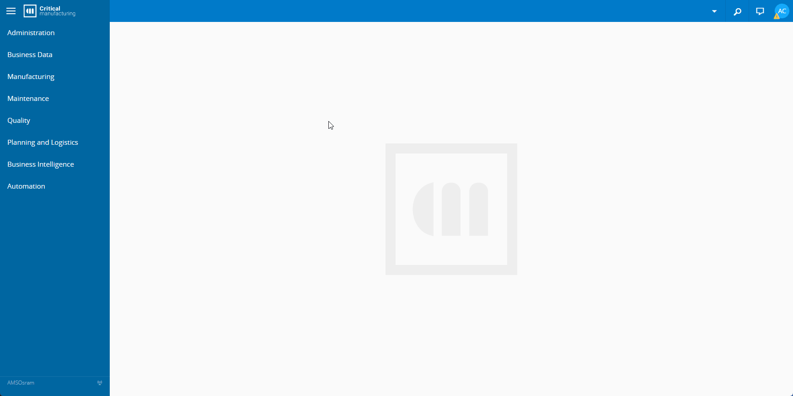

# How to inkove service exposed on API?

## Overview

On this topic will demonstrate all the necessary steps to create an Access Token and invoke a service exposed on the API endpoint using alphanumeric token created.

## Create Access Token by User

Follow the steps bellow to create Access Token:

1. Go to the *Administration* menu and select **Security**.
   - Select **Users**.
1. On **Users** tab select the user will be associate *Access Token*.
   - Go to *Access Token* and select **Create**.
   - Fill the fields:
     - *Name*: Token Name.
     - *Expires on*: Token validity.



## Invoke service exposed on API

The code bellow is used to invoke a service exposed on API:

```bash
$ curl --location --request POST 'http://<HostURL>:<HostPort>/api/AMSOsram/<ServiceName>' \
--header 'Content-Type: application/json' \
--header 'Authorization: Bearer <Token>' \
--data-raw '{
    "$type": "Cmf.Custom.AMSOsram.Orchestration.InputObjects.<CustomInputEntity>, Cmf.Custom.AMSOsram.Orchestration",
    <CustomInputEntityProperties>
}'
```

### Arguments

|  Name                           | Description                                                                    |
| ------------------------------- | ------------------------------------------------------------------------------ |
| `<HostURL>`                     | Server address                                                                 |
| `<HostPort>`                    | Server port configured to access API                                           |
| `<ServiceName>`                 | Name of the [service](/AMSOsram/techspec>artifacts>services.md)                |
| `<Token>`                       | Alphanumeric code generated on previous [topic](#create-access-token-by-user)  |
| `<CustomInputEntity>`           | Entity associted with the service                                              |
| `<CustomInputEntityProperties>` | All properties associated with the Entity                                      |
