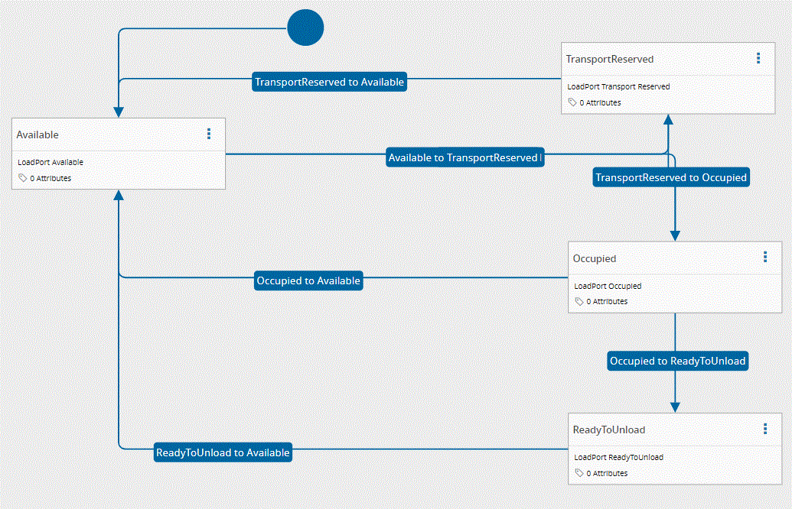

# CustomLoadPortStateModelState

## Overview

This State Model is responsible for keeping the state of the Load Port.

## States

| State Name | Is Initial | Is Final |
| :--- | :----: | :---------- |
| Available | true  | false |
| Occupied | false | false |
| ReadyToUnload | false | false |
| TransportReserved | false | false |

## Transitions

| Initial State | Final State |
| :--- | :---- |
| Available | TransportReserved |
| TransportReserved | Available |
| TransportReserved | Occupied |
| Occupied | Available |
| Occupied | ReadyToUnload |
| ReadyToUnload | Available |