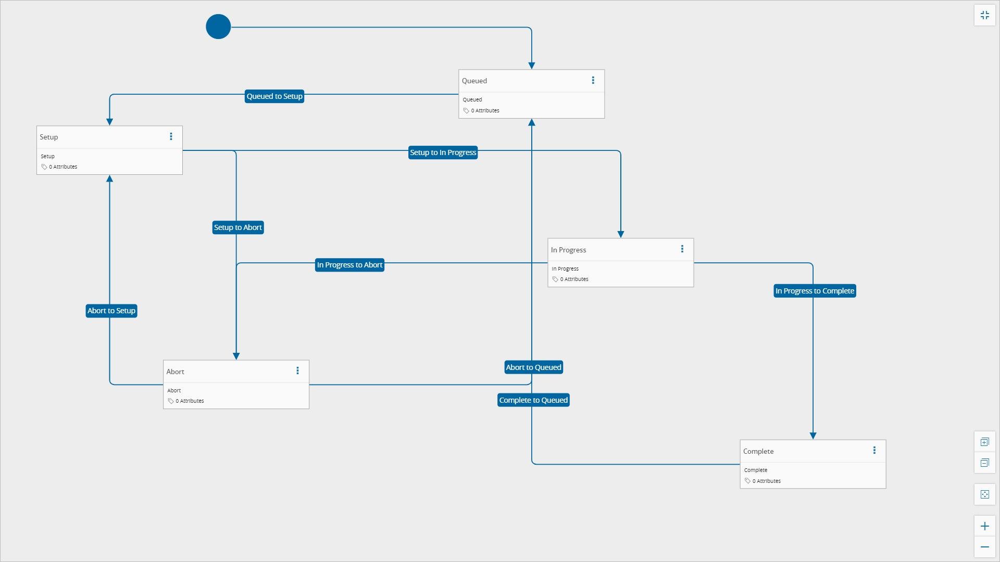

# CustomMaterialStateModel

## Overview

This State Model is responsible for keeping the state of the lot.

## States

| State Name | Is Initial | Is Final |
| :--- | :----: | :---------- |
| Queued | true  | false |
| Setup | false | false |
| In Progress | false | false |
| Abort | false | false |
| Complete | false | false |

## Transitions

| Initial State | Final State |
| :--- | :---- |
| Queued | Setup |
| Setup | In Progress |
| Setup | Abort |
| In Progress | Abort |
| In Progress | Complete |
| Abort | Setup |
| Abort | Queued |
| Complete | Queued |

