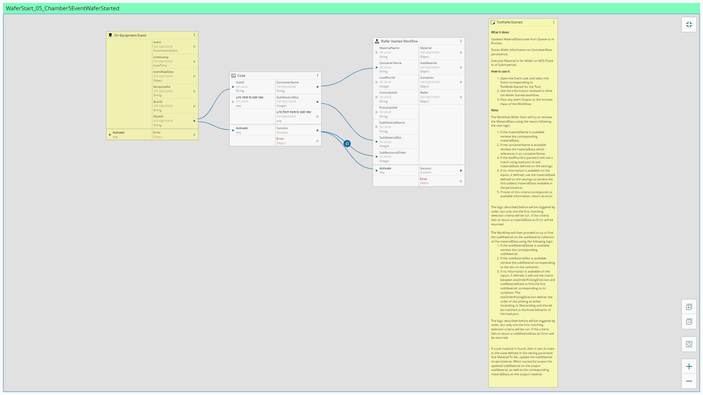

Workflows
============

In this section the workflows will be described.

Setup
============

MaterialReceived_01_MaterialReceivedEvent
============

CarrierIdRead_01_EventReceived
============

SlotMap_01_SlotMapReceived
============

ReadyToUnload_01_EventReceived
============

MaterialRemoved_01_MaterialRemovedEvent
============

TrackIn_01_TrackInRequestReceived
============

ProcessStarted_01_EventTosProcessStartedReceived
============

ProcessStarted_02_EventTosProcessStartedReceived
============

WaferStart_01_Chamber1EventWaferStarted
============

WaferStart_02_Chamber2EventWaferStarted
============

WaferStart_03_Chamber3EventWaferStarted
============

WaferStart_04_Chamber4EventWaferStarted
============

WaferStart_05_Chamber5EventWaferStarted
============

WaferStart_06_Chamber6EventWaferStarted
============

WaferComplete_01_Chamber1EventWaferCompleted
============

WaferComplete_02_Chamber2EventWaferCompleted
============

WaferComplete_03_Chamber3EventWaferCompleted
============

WaferComplete_04_Chamber4EventWaferCompleted
============

WaferComplete_05_Chamber5EventWaferCompleted
============

WaferComplete_06_Chamber6EventWaferCompleted
============

ProcessCompleted_01_EventProcessCompletedReceived
============

TrackOut_01_TrackOutEventReceivedFromMES
============

Abort_01_AbortEventReceivedFromMES
============

Hold_01_HoldEventReceivedFromMES
============

AlarmManagement_01_AlarmCollection
============

RecipeManagement_01_GetRecipeList
============

RecipeManagement_02_GetRecipeBody
============

ResourceState_01_ProcessStateChanged
============

ResourceEPTState_01_EptStateChangeEquipmentReceived
============

ResourceEPTState_02_EptStateLoadPort1ChangeEquipmentReceived
============

ResourceEPTState_03_EptStateLoadPort2ChangeEquipmentReceived
============

ControlState_01_ControlStateEquipmentOfflineUpdateReceived
============

ControlState_02_ControlStateOnlineLocalUpdateReceived
============

ControlState_03_ControlStateOnlineRemoteUpdateReceived
============

RecipeValidation_01_UnformattedRecipeMainFlow
============

CassetteLoad_01_ExecuteCommand
============

CassetteUnload_01_ExecuteCommand
============

AbortJob_01_ExecuteControlJobAbort
============

CreateProcessJob_01_CreateJob
============

CreateControlJob_01_CreateJob
============

