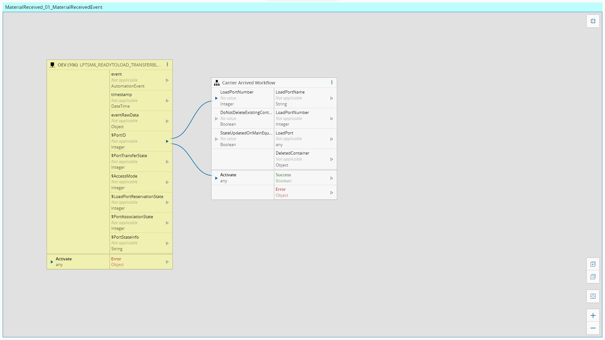
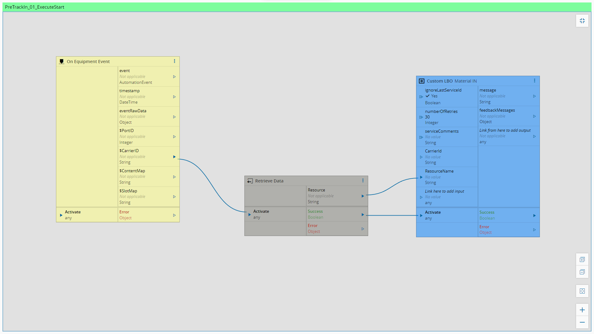
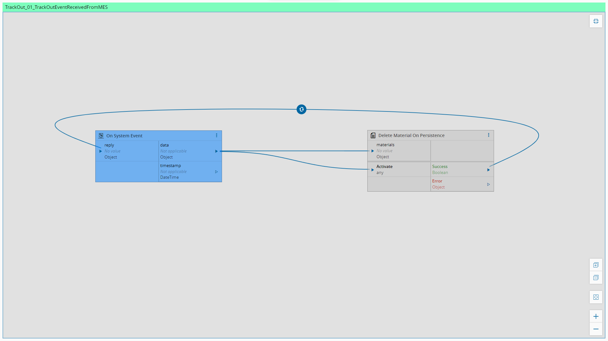
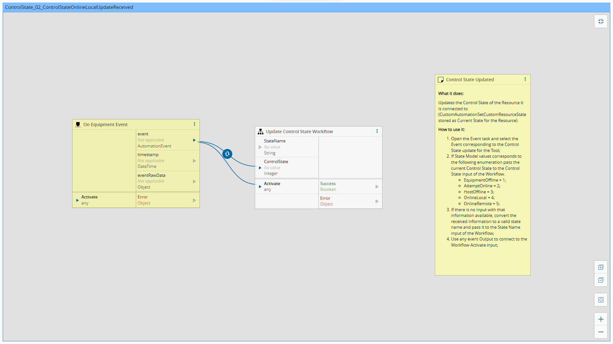
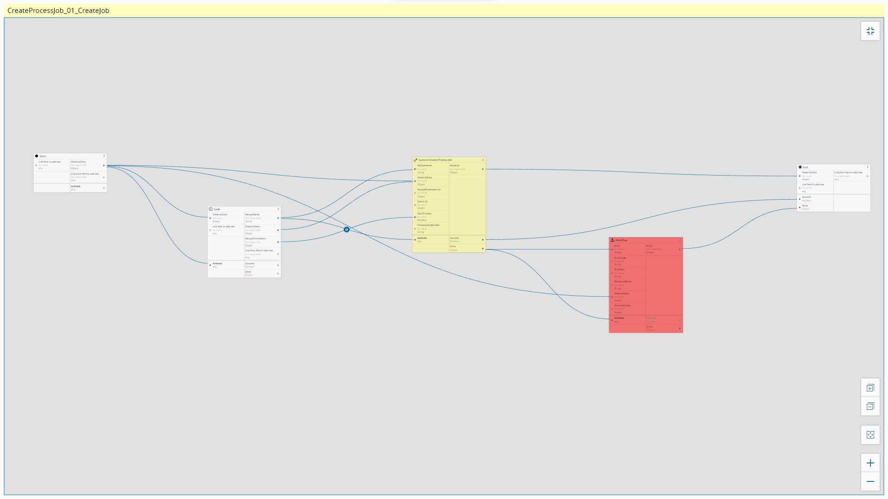
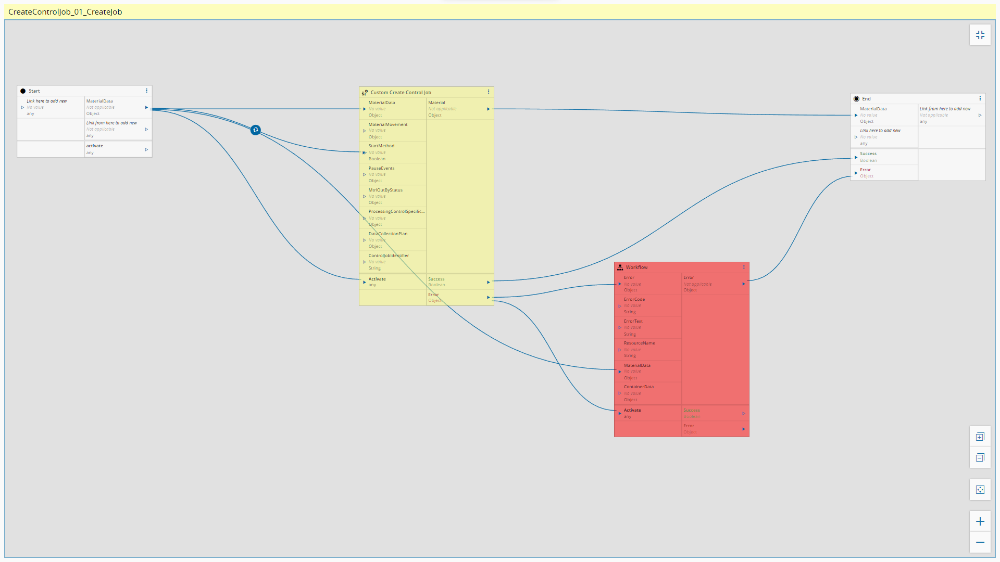

Workflows
============

In this section the workflows will be described.

Setup
============

	
MaterialReceived_01_MaterialReceivedEvent
============

	
CarrierIdRead_01_EventReceived
============

	
SlotMap_01_SlotMapReceived
============

	
ReadyToUnload_01_EventReceived
============

	
MaterialRemoved_01_MaterialRemovedEvent
============

	
TrackIn_01_TrackInRequestReceived
============

	
PreTrackIn_01_ExecuteStart
============

	
ProcessStarted_01_EventTosProcessStartedReceived
============

	
WaferStart_01_EventWaferStarted
============

	
WaferIdRead_01_EventWaferIdRead
============

	
WaferComplete_01_EventWaferCompleted
============

	
ProcessCompleted_01_EventProcessCompletedReceived
============

	
TrackOut_01_TrackOutEventReceivedFromMES
============

	
Abort_01_AbortEventReceivedFromMES300mm
============

	
Hold_01_HoldEventReceivedFromMES
============

	
AlarmManagement_01_AlarmCollection
============

	
RecipeManagement_01_GetRecipeList
============

	
RecipeManagement_02_GetRecipeBody
============

	
RecipeManagement_03_SetRecipeBody
============

	
RecipeManagement_04_GetRecipeChecksum
============

	
<!-- ResourceState_01_ProcessStateChanged
============

	
ResourceEPTState_01_EptStateChangeReceived
============
 -->
	
ControlState_01_ControlStateEquipmentOfflineUpdateReceived
============

	
ControlState_02_ControlStateOnlineLocalUpdateReceived
============

	
ControlState_03_ControlStateOnlineRemoteUpdateReceived
============

	
SendAdHocRequest_01_SendAdHocReceivedFromMES
============

	
RecipeValidation_01_UnformattedRecipeMainFlow
============

	
CreateProcessJob_01_CreateJob
============

	
CreateControlJob_01_CreateJob
============

	
AbortJob_01_ExecuteControlJobAbort
============

ProceedWithSubstrate_01_SendCommand
============
