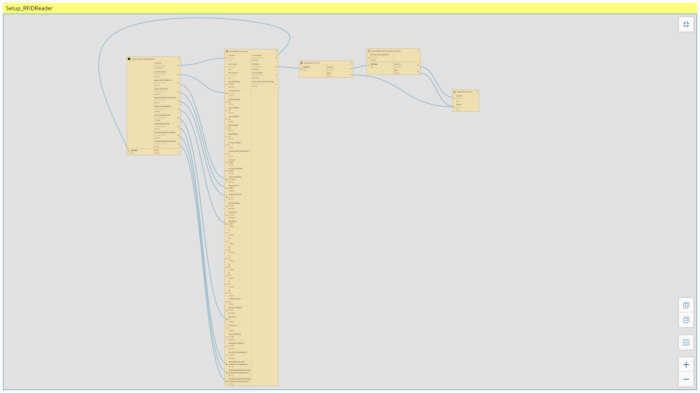
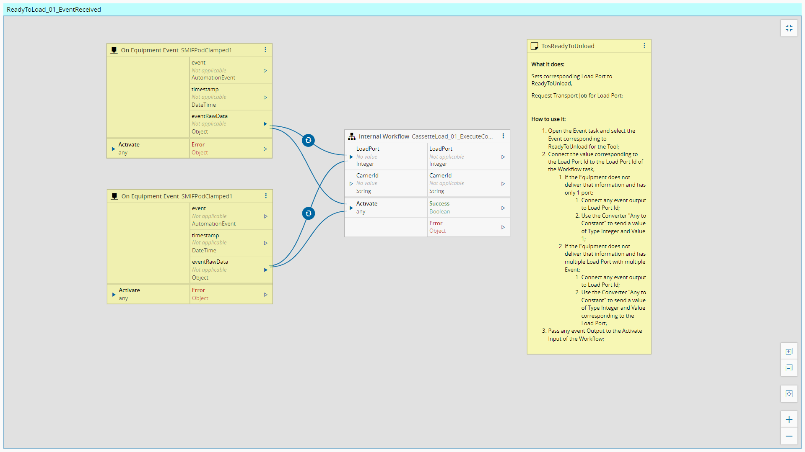
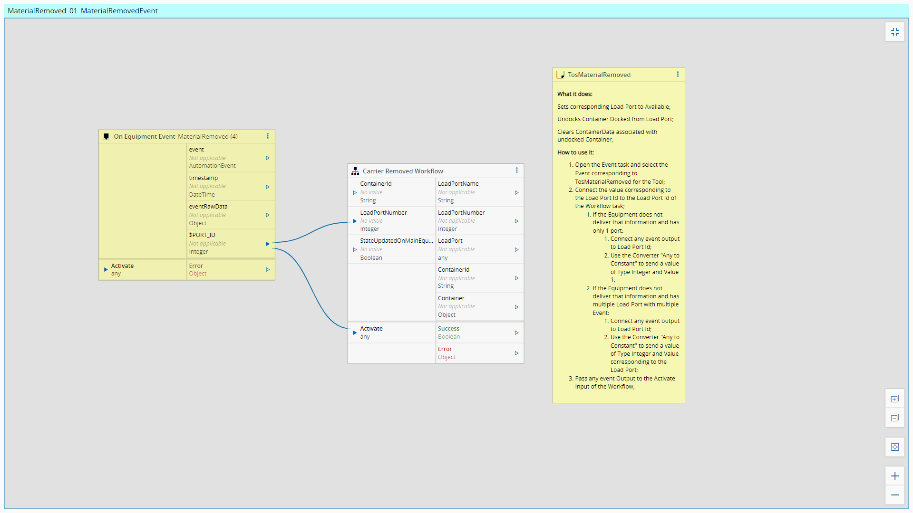
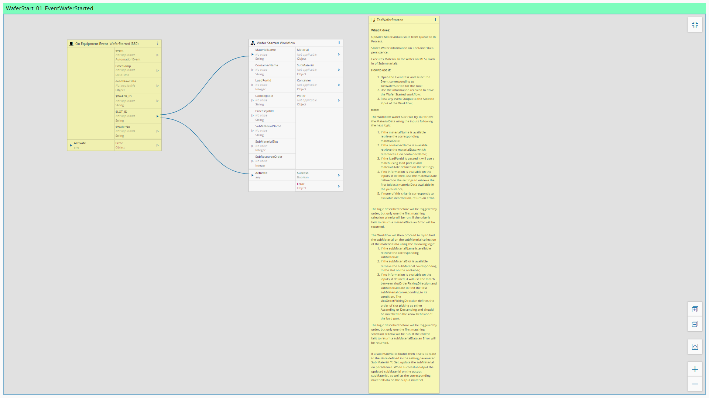
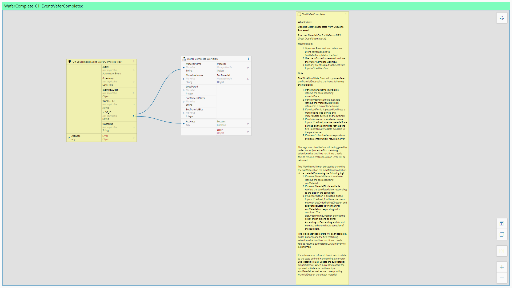
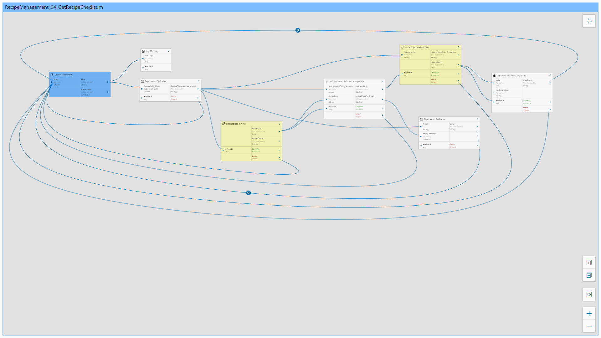
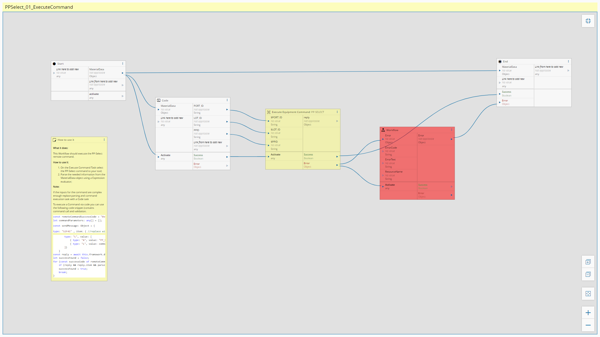

Workflows
============

In this section the workflows are described

Setup
============

This is the workflow implemented for **Setup**

Setup_RFIDReader
============

This is the workflow implemented for **Setup_RFIDReader**

MaterialReceived_01_MaterialReceivedCarrierIdReadRequest
============

This is the workflow implemented for **MaterialReceived_01_MaterialReceivedCarrierIdReadRequest**

ReadyToLoad_01_EventReceived
============

This is the workflow implemented for **ReadyToLoad_01_EventReceived**

SlotMap_01_SlotMapReceived
============

This is the workflow implemented for **SlotMap_01_SlotMapReceived**

ReadyToUnload_01_EventReceived
============

This is the workflow implemented for **ReadyToUnload_01_EventReceived**

MaterialRemoved_01_MaterialRemovedEvent
============

This is the workflow implemented for **MaterialRemoved_01_MaterialRemovedEvent**

TrackIn_01_TrackInRequestReceived
============

This is the workflow implemented for **TrackIn_01_TrackInRequestReceived**

PostTrackIn_01_ExecuteStart
============

This is the workflow implemented for **PostTrackIn_01_ExecuteStart**

ProcessStarted_01_EventTosProcessStartedReceived
============

This is the workflow implemented for **ProcessStarted_01_EventTosProcessStartedReceived**

WaferStart_01_EventWaferStarted
============

This is the workflow implemented for **WaferStart_01_EventWaferStarted**

WaferComplete_01_EventWaferCompleted
============

This is the workflow implemented for **WaferComplete_01_EventWaferCompleted**

ProcessCompleted_01_EventProcessCompletedReceived
============

This is the workflow implemented for **ProcessCompleted_01_EventProcessCompletedReceived**

TrackOut_01_TrackOutEventReceivedFromMES
============

This is the workflow implemented for **TrackOut_01_TrackOutEventReceivedFromMES**

Abort_01_AbortEventReceivedFromMES
============

This is the workflow implemented for **Abort_01_AbortEventReceivedFromMES**

Hold_01_HoldEventReceivedFromMES
============

This is the workflow implemented for **Hold_01_HoldEventReceivedFromMES**

AlarmManagement_01_AlarmCollection
============

This is the workflow implemented for **AlarmManagement_01_AlarmCollection**

RecipeManagement_01_GetRecipeList
============

This is the workflow implemented for **RecipeManagement_01_GetRecipeList**

RecipeManagement_02_GetRecipeBody
============

This is the workflow implemented for **RecipeManagement_02_GetRecipeBody**

RecipeManagement_03_SetRecipeBody
============

This is the workflow implemented for **RecipeManagement_03_SetRecipeBody**

RecipeManagement_04_GetRecipeChecksum
============

This is the workflow implemented for **RecipeManagement_04_GetRecipeChecksum**

ControlState_01_ControlStateUpdateReceived
============

This is the workflow implemented for **ControlState_01_ControlStateUpdateReceived**

SendAdHocRequest_01_SendAdHocReceivedFromMES
============

This is the workflow implemented for **SendAdHocRequest_01_SendAdHocReceivedFromMES**

RecipeValidation_01_UnformattedRecipeMainFlow
============

This is the workflow implemented for **RecipeValidation_01_UnformattedRecipeMainFlow**

PPSelect_01_ExecuteCommand
============

This is the workflow implemented for **PPSelect_01_ExecuteCommand**

StartCommand_01_ExecuteCommand
============

This is the workflow implemented for **StartCommand_01_ExecuteCommand**

CassetteLoad_01_ExecuteCommand
============

This is the workflow implemented for **CassetteLoad_01_ExecuteCommand**

CassetteUnload_01_ExecuteCommand
============

This is the workflow implemented for **CassetteUnload_01_ExecuteCommand**

CarrierClamped_01_ExecuteCommand
============

This is the workflow implemented for **CarrierClamped_01_ExecuteCommand**

CarrierUnclamped_01_ExecuteCommand
============

This is the workflow implemented for **CarrierUnclamped_01_ExecuteCommand**

