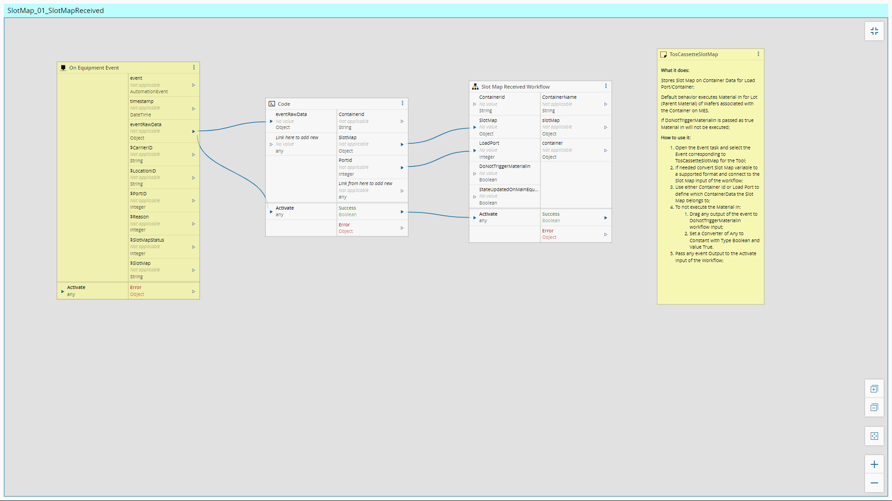
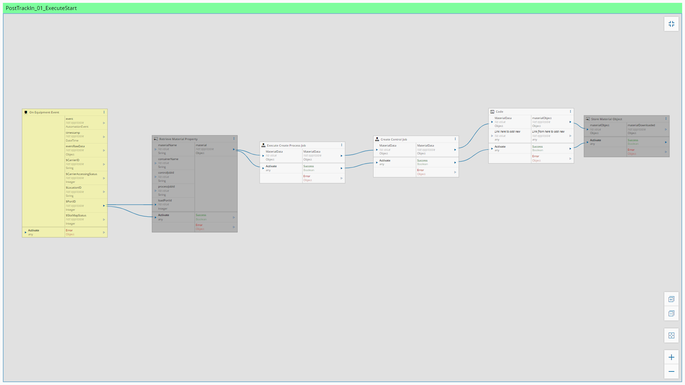
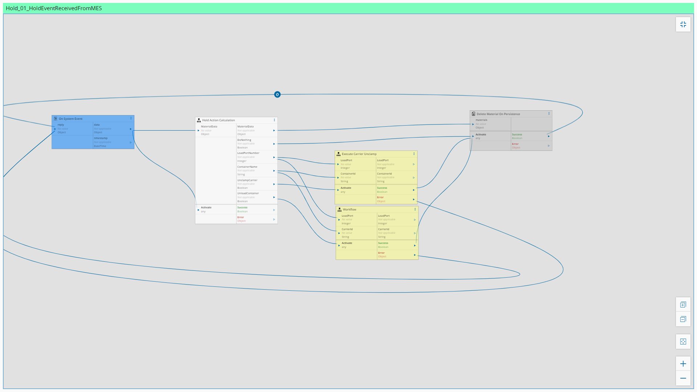

Workflows
============

In this section the workflows will be described.

Setup
============

MaterialReceived_01_MaterialReceivedEvent
============

MaterialReceived_02_MaterialReceivedEvent
============

MaterialReceived_03_MaterialReceivedEvent
============

CarrierIdRead_01_EventReceived
============

SlotMap_01_SlotMapReceived
============

ReadyToUnload_01_EventReceived
============

MaterialRemoved_01_MaterialRemovedEvent
============

TrackIn_01_TrackInRequestReceived
============

PostTrackIn_01_ExecuteStart
============

ProcessStarted_01_EventTosProcessStartedReceived
============

WaferStart_01_EventWaferStarted
============

WaferComplete_01_EventWaferCompleted
============

WaferComplete_02_EventWaferCompleted
============

ProcessCompleted_01_EventProcessCompletedReceived
============

TrackOut_01_TrackOutEventReceivedFromMES
============

Abort_01_AbortEventReceivedFromMES300mm
============

Hold_01_HoldEventReceivedFromMES
============

AlarmManagement_01_AlarmCollection
============

RecipeManagement_01_GetRecipeList
============

RecipeManagement_02_GetRecipeBody
============

RecipeManagement_03_SetRecipeBody
============

RecipeManagement_04_GetRecipeChecksum
============

ResourceState_01_ProcessStateChanged
============

ResourceEPTState_01_EptStateChangeReceived
============

ControlState_01_ControlStateEquipmentOfflineUpdateReceived
============

ControlState_02_ControlStateOnlineLocalUpdateReceived
============

ControlState_03_ControlStateOnlineRemoteUpdateReceived
============

SendAdHocRequest_01_SendAdHocReceivedFromMES
============

RecipeValidation_01_UnformattedRecipeMainFlow
============

CreateProcessJob_01_CreateJob
============

CreateControlJob_01_CreateJob
============

AbortJob_01_ExecuteControlJobAbort
============

