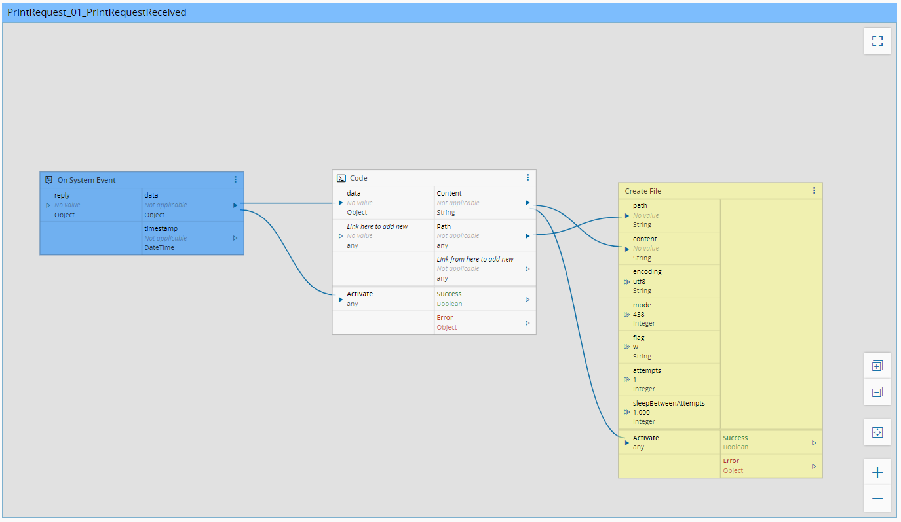

Workflows
============

In this section the Workflows must be described.

Setup
============
Setup is the workflows responsible for establishing the communication.

PrintRequest_01_PrintRequestReceived
============
**PrintRequest_01_PrintRequestReceived** is responsible for receiving the print request from MES and writing a file based on the print request content to a defined location.

