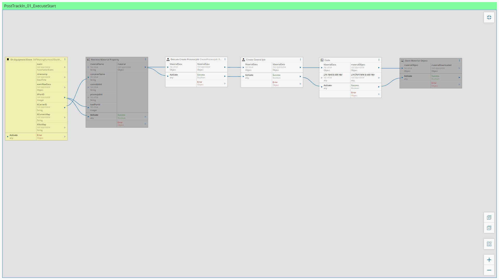
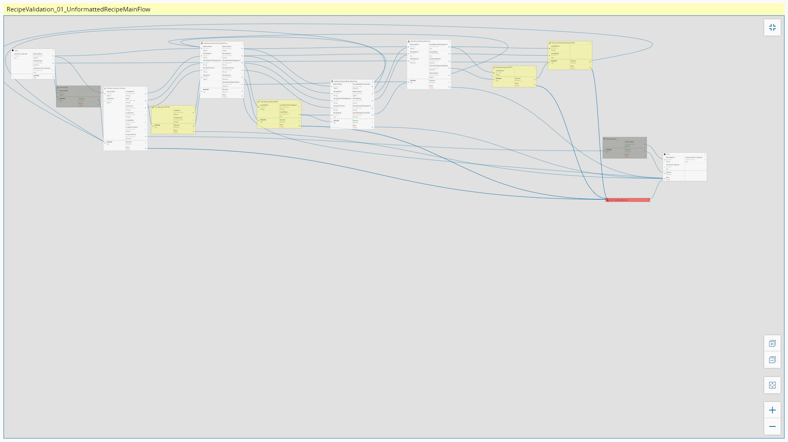

Workflows
============

In this section the workflows are described

Setup
============

This is the workflow implemented for **Setup**

Setup_RFIDReader
============

This is the workflow implemented for **Setup_RFIDReader**

MaterialReceived_01_MaterialReceivedCarrierIdReadRequest
============

This is the workflow implemented for **MaterialReceived_01_MaterialReceivedCarrierIdReadRequest**

SlotMap_01_SlotMapReceived
============

This is the workflow implemented for **SlotMap_01_SlotMapReceived**

ReadyToUnload_01_EventReceived
============

This is the workflow implemented for **ReadyToUnload_01_EventReceived**

MaterialRemoved_01_MaterialRemovedEvent
============

This is the workflow implemented for **MaterialRemoved_01_MaterialRemovedEvent**

TrackIn_01_TrackInRequestReceived300mm
============

This is the workflow implemented for **TrackIn_01_TrackInRequestReceived300mm**

PostTrackIn_01_ExecuteStart
============

This is the workflow implemented for **PostTrackIn_01_ExecuteStart**

ProcessStarted_01_EventTosProcessStartedReceived
============

This is the workflow implemented for **ProcessStarted_01_EventTosProcessStartedReceived**

WaferStart_01_EventWaferStarted
============

This is the workflow implemented for **WaferStart_01_EventWaferStarted**

WaferComplete_01_EventWaferCompleted
============

This is the workflow implemented for **WaferComplete_01_EventWaferCompleted**

ProcessCompleted_01_EventProcessCompletedReceived
============

This is the workflow implemented for **ProcessCompleted_01_EventProcessCompletedReceived**

TrackOut_01_TrackOutEventReceivedFromMES
============

This is the workflow implemented for **TrackOut_01_TrackOutEventReceivedFromMES**

Abort_01_AbortEventReceivedFromMES300mm
============

This is the workflow implemented for **Abort_01_AbortEventReceivedFromMES300mm**

Hold_01_HoldEventReceivedFromMES
============

This is the workflow implemented for **Hold_01_HoldEventReceivedFromMES**

AlarmManagement_01_AlarmCollection
============

This is the workflow implemented for **AlarmManagement_01_AlarmCollection**

RecipeManagement_01_GetRecipeList
============

This is the workflow implemented for **RecipeManagement_01_GetRecipeList**

RecipeManagement_02_GetRecipeBody
============

This is the workflow implemented for **RecipeManagement_02_GetRecipeBody**

RecipeManagement_03_SetRecipeBody
============

This is the workflow implemented for **RecipeManagement_03_SetRecipeBody**

RecipeManagement_04_GetRecipeChecksum
============

This is the workflow implemented for **RecipeManagement_04_GetRecipeChecksum**

ResourceState_01_ProcessStateChanged
============

This is the workflow implemented for **ResourceState_01_ProcessStateChanged**

ResourceEPTState_01_EptStateChangeReceived
============

This is the workflow implemented for **ResourceEPTState_01_EptStateChangeReceived**

ResourceEPTState_02_EptStateChangeReceived
============

This is the workflow implemented for **ResourceEPTState_02_EptStateChangeReceived**

ResourceEPTState_03_EptStateChangeReceived
============

This is the workflow implemented for **ResourceEPTState_03_EptStateChangeReceived**

ResourceEPTState_04_EptStateChangeReceived
============

This is the workflow implemented for **ResourceEPTState_04_EptStateChangeReceived**

ResourceEPTState_05_EptStateChangeReceived
============

This is the workflow implemented for **ResourceEPTState_05_EptStateChangeReceived**

ResourceEPTState_06_EptStateChangeReceived
============

This is the workflow implemented for **ResourceEPTState_06_EptStateChangeReceived**

ControlState_01_ControlStateUpdateReceived
============

This is the workflow implemented for **ControlState_01_ControlStateUpdateReceived**

SendAdHocRequest_01_SendAdHocReceivedFromMES
============

This is the workflow implemented for **SendAdHocRequest_01_SendAdHocReceivedFromMES**

RecipeValidation_01_UnformattedRecipeMainFlow
============

This is the workflow implemented for **RecipeValidation_01_UnformattedRecipeMainFlow**

CreateProcessJob_01_CreateJob
============

This is the workflow implemented for **CreateProcessJob_01_CreateJob**

CreateControlJob_01_CreateJob
============

This is the workflow implemented for **CreateControlJob_01_CreateJob**

AbortJob_01_ExecuteControlJobAbort
============

This is the workflow implemented for **AbortJob_01_ExecuteControlJobAbort**

